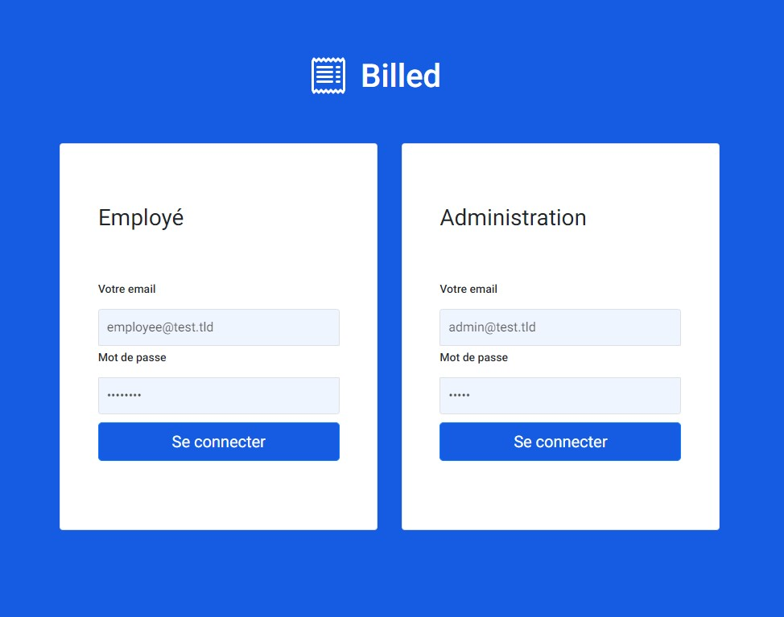

## Contexte
- Billed, une entreprise qui produit des solutions Saas destinées aux équipes de ressources humaines. Dans deux semaines, l’équipe doit montrer la solution qui fonctionne à l’ensemble de l’entreprise. 
---
## Objectifs
Corriger les derniers bugs et mise en place de tests sur la fonctionnalité “note de frais” avant de lancer officiellement auprès de nos clients d’ici 2 semaines. 

- cliquez pour voir le [Descriptif](Assets/Descriptif_fonctionnalites.pdf)
- cliquez pour consulter le [Descriptif des besoins](Assets/Billed%2B-%2BDescription%2Bpratique%2Bdes%2Bbesoins%2B-.pdf)

---

[Kanban](https://www.notion.so/a7a612fc166747e78d95aa38106a55ec?v=2a8d3553379c4366b6f66490ab8f0b90)

## TO DO  
 
 ### 1- Bug-report 
 * Fixer les bugs identifiés dans le rapport de Bug fourni par Jest
 Utiliser Chrome Debugger. Copie disponible dans le Kanban 
* Règles / contraintes
Utiliser chrome Debugger

--- 
### 2- Bug-hunt
* Fixer les bugs identifiés par leila sur le parcours  "employé",
ils sont décrits dans le Kanban

* Règles / contraintes
Utiliser chrome Debugger
---


### 3- Tests unitaires et d’intégration : 
* Ajouter des tests unitaires et d’intégration pour les fichiers Bills et NewBill. Ils vont permettre d’éliminer les bugs et d’éviter toute régression lors des prochaines évolutions de la solution. Certains tests sont déjà développés (pour le Login et pour le Dashboard côté administrateur RH) : ils sont déjà cochés sur le kanban. Il faut s’en inspirer pour les restants. 

* Règles/contraintes : Il faut assurer un taux de couverture global des containers de 80% minimum (tests unitaires & tests d’intégration).
--- 
### 4- Test End-to-End : 

* Rédiger un plan de test End-to-End (E2E) sur le parcours employé pour guider Leïla. 

* Règles/contraintes : Manque de temps pour automatiser les tests (E2E). Ils seront effectués manuellement par Leila. S’inspirer du plan E2E que Garance a déjà rédigé sur le parcours administrateur RH.

--- 
## Architecture du projet
### Ce projet, dit frontend, est connecté à un service API backend que vous devez aussi lancer en local.
### Le projet backend se trouve [ici](https://github.com/pascalinecte91/Billed-app-back) 
---
### Organiser son espace de travail :

Pour une bonne organization, vous pouvez créer un dossier bill-app dans lequel vous allez cloner le projet backend et par la suite, le projet frontend:

[Clonez le projet frontend dans le dossier bill-app](https://github.com/OpenClassrooms-Student-Center/Billed-app-FR-Front.git)


```
bill-app/
   - Billed-app-FR-Back
   - Billed-app-FR-Front
```

## Comment lancer l'application en local ?

### étape 1 - Lancer le backend :

Suivez les indications dans le README du projet backend.

### étape 2 - Lancer le frontend :

Allez au repo cloné :
```
$ cd Billed-app-FR-Front
```

Installez les packages npm (décrits dans `package.json`) :
```
$ npm install
```

Installez live-server pour lancer un serveur local :
```
$ npm install -g live-server
```

Lancez l'application :
```
$ live-server
```

Puis allez à l'adresse : `http://127.0.0.1:8080/`


## Comment lancer tous les tests en local avec Jest ?

```
$ npm run test
```

## Comment lancer un seul test ?

Installez jest-cli :

```
$npm i -g jest-cli
$jest src/__tests__/your_test_file.js
```

## Comment voir la couverture de test ?

`http://127.0.0.1:8080/coverage/lcov-report/`


## Comptes et utilisateurs :

Vous pouvez vous connecter en utilisant les comptes:

### administrateur : 

utilisateur : admin@test.tld 
mot de passe : admin

---
### employé :

utilisateur : employee@test.tld
mot de passe : employee

